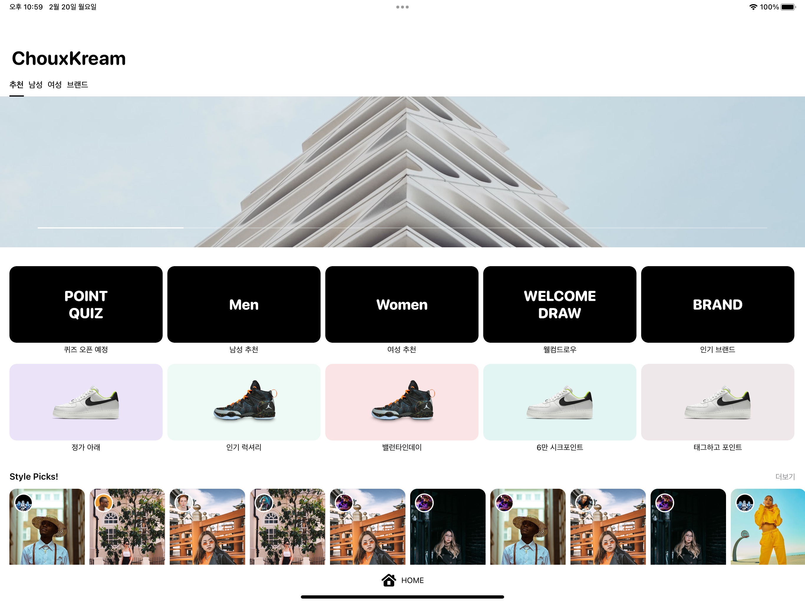

# ChouxKream
An experimental clone of the KREAM app for toy project.

## Description
I copied KREAM, a popular mobile app for discovering and purchasing fashion items, with an app called ChouxKream. This project is built on the CKRCollectionController module, which allows for easy development and reuse of CollectionView sections. By reusing existing sections, developers can quickly create new screens and features, reducing the time and effort required for development. It offers adaptive layouts on iPad as well as iOS and works in split view environments. App architecture is inspired by [this](https://developer.android.com/topic/architecture).